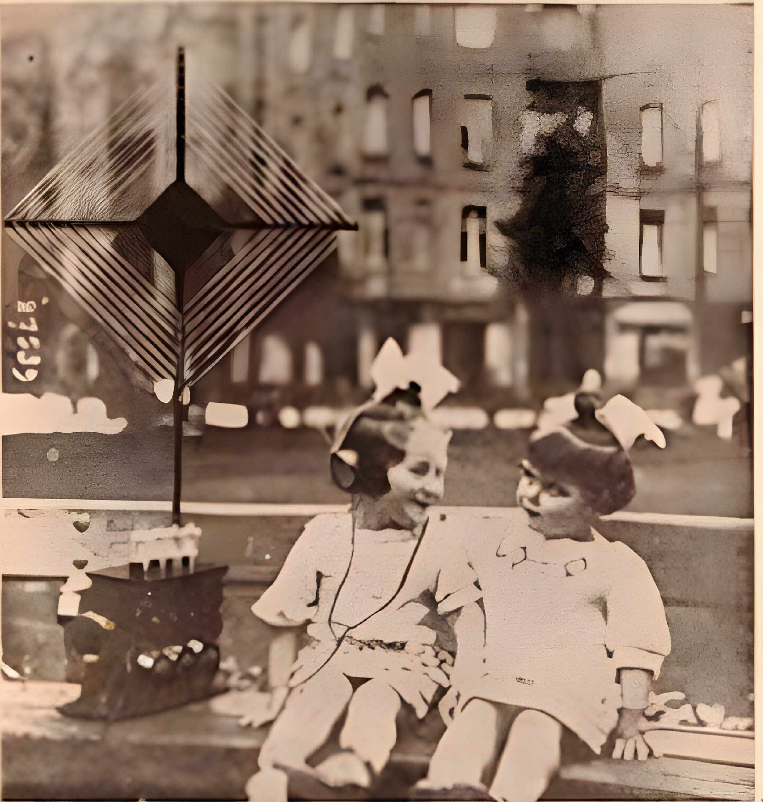
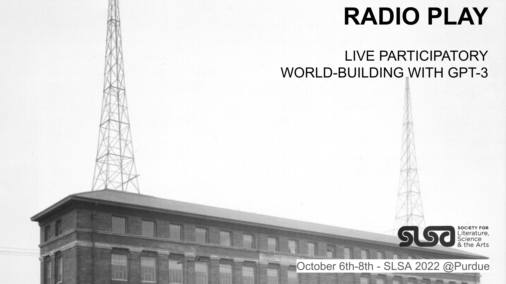

# Description

_AI Radio Play: Live Participatory Worldbuilding with GPT_ is an introduction for writers, theater makers, and creatives to generative text through a hands-on workshop culminating in a live, machine co-authored radio show.

Recent advancements with large language models demonstrate remarkable achievements in text synthesis, understanding, and generation. This hands-on workshop introduces state-of-the-art transformer models (GPT) through an interactive event culminating in a live radio performance and internet broadcast. Participants gain experience with collaborative worldbuilding, liveness and improv, and collective co-authorship with AI, particularly the variation induced through the unknowable contributions of improvisatory humans and large language models.

# Episode 1
[Episode 1 Barcelona, Spain ISEA2022 Possibles](ep1/). June 11, 10-6pm CEST. CCCB. 

# Episode 2
[Episode 2 West Lafayette, Indiana SLSA 2022 Reading Minds](ep2/) @ Purdue. October 7-8, 1:00-3:00 EDT. 

# Episode 3
[Episode 3 Paris, France ISEA2023 Symbiosis](ep3/). May 16-21, 2023. Forum des Images. 

# Team
### Leads
**Ash Smith** - Speculative Devices Lab, Johnny Carson for Emerging Media Arts, UNL - [asheveryday.com](https://asheveryday.com/) 
**Robert Twomey** - [Machine Cohabitation Lab](http://cohab-lab.net), Johnny Carson for Emerging Media Arts, UNL - [roberttwomey.com](https://roberttwomey.com) 

### Collaborators
**Miller Puckette** - Distinguished Professor Emeritus, UC San Diego - [http://msp.ucsd.edu/](http://msp.ucsd.edu/) 
**Jinku Kim** - Johnny Carson for Emerging Media Arts, UNL - [www.grayscale64.com](www.grayscale64.com) 
**Stephanie Sherman** - Central St. Martins MA Narrative Environments, Radio Espacio Estación - [stephaniesherman.info](stephaniesherman.info) 
**Agustina Woodgate** - Radio Espacio Estación - [agustinawoodgate.com](agustinawoodgate.com) 
**Hernan Woodgate** - Radio Espacio Estación - [radioee.net](radioee.net) 
**Patrick Coleman** - Arthur C. Clarke Center for Human Imagination, UCSD - [patrickcoleman.org](patrickcoleman.org) 

# References
Read more about the project here: [https://roberttwomey.com/radio-play](https://roberttwomey.com/radio-play)

_This project is made possible through generous support from the Johnny Carson Center for Emerging Media Arts_
