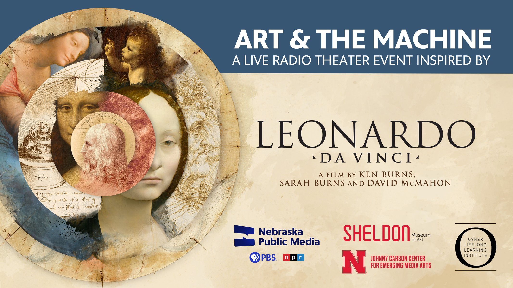

# Description

<h2> <<< STREAM HERE >>> 1700-1800 CEST. January 23, 2025 </h2>

Leonardo da Vinci was an artist and inventor ahead of his time, a speculative designer of machines and inventions that were too sophisticated to be realized in his day.

Join us for a free live performance event inspired by his boundary-pushing curiosity about wind, birds and flying machines, featuring an original radio theater production co-created by OLLI at UNL members and generative AI under the guidance of artists Ash Eliza Smith, Robert Twomey, and their team of artists, researchers and students from the Johnny Carson Center for Emerging Media Arts.

The evening will also feature an excerpt from the recent PBS documentary Leonardo da Vinci that inspired the radio play, plus insights into this unique artistic process that merges human creativity with artificial intelligence.

**Community Partners**

Presented by Nebraska Public Media, Sheldon Museum of Art, Osher Lifelong Learning Institute (OLLI at UNL) and the Johnny Carson Center for Emerging Media Arts at UNL. A Speculative Devices and Cohab Labs co-production.

# Team
- **Ash Smith** - Speculative Devices Lab, Johnny Carson for Emerging Media Arts, UNL - [asheveryday.com](https://asheveryday.com/) 
- **Robert Twomey** - [Machine Cohabitation Lab](http://cohab-lab.net), Visual Arts, UCSD - [roberttwomey.com](https://roberttwomey.com) 
- Reid Brockmeier
- Sam
- Hank
- Wyatt

# References
- Previous [AI Radio Theater performances](all_episodes.md).
- [Sheldon Museum of Art](https://sheldonartmuseum.org/art-and-machine-live-radio-theater-event-inspired-leonardo-da-vinci/)

_This project is made possible through generous support from [the Johnny Carson Center for Emerging Media Arts](https://carsoncenter.unl.edu/), [Nebraska Public Media](https://nebraskapublicmedia.org/en/watch/community-engagement/leonardo-da-vinci/), the [Sheldon Museum of Art](https://sheldonartmuseum.org/), the [Department of Visual Arts at UC San Diego](https://visarts.ucsd.edu/), and the [Osher Lifelong Learning Institute at the University of Nebraska-Lincoln](https://olli.unl.edu/)._
