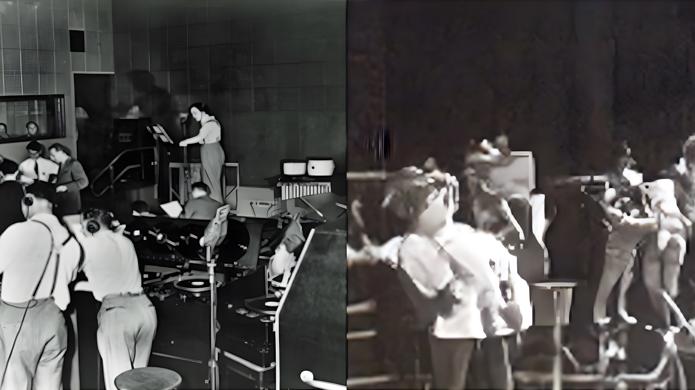

<!--

From [_The Strange Survival of Radio Drama_](https://www.bbc.com/historyofthebbc/100-voices/radio-reinvented/the-strange-survival-of-radio-drama/), BBC 100.
-->

A workshop for [ISEA2022 Possibles](https://isea2022.isea-international.org/). June 11, 10-6pm CEST. [CCCB, Aula 1](https://www.cccb.org/es/servicios/alquiler-de-espacios/aula-1/9738)

<!-- <h1><a href="https://s3.radio.co/s70d0dcdd7/listen" target="_blank"><<< LISTEN LIVE >>></a></h1> 5-5:30 CEST/1500-1530 GMT
-->

<h1><<< LISTEN LIVE >>></h1> 5-5:30 CEST/1500-1530 GMT June 11

[recording](https://drive.google.com/file/d/17tCo1KDt7q485hBkwBPB1XM5c5xY1d2c/)

# Description

With recent advancements in machine learning techniques, researchers have demonstrated remarkable achievements in text synthesis, understanding, and generation. This hands-on workshop introduces state-of-the-art transformer model (GPT-3) through a participatory, interactive event culminating in a live radio show and internet transmission. Participants will gain experience with Open AI's GPT-3 as members of an AI writers room. We will discuss issues of liveness and serendipity; possibilities for human/non-human co-authorship; and relate these computational processes to human language, perception, and embodiment. Please bring a text you would like to experiment with!

# Schedule

Saturday, June 11 2022

|    Time    | Activity |
|------------|----|
| 10:00	| __Introduction__    Background and setup |
| 10:30	| Activity: warming up our language engines (Discord). Discuss. |
| 11:00	| __Writer's Rooms 1__: Worldbuilding (small groups) |
| 11:45 | Reconvene: share out and decide on concept, themes |
| 12:00	| __Writer's Rooms 2__: Developing scenes (small group) | 
| 12:45 | Reconvene: share out scene progress, sign up for production. Other elements (sponsor messages, etc.)
| 13:00	| ~ lunch break ~ |
| 14:00 | __Pre-Production__: Peformance Planning  |
| 15:00 | Reconvene: share out. Sequence blocks, timing. | 
| 16:00 | Rehearsal and Sound Check | 
| 17:00 | __Performance and Broadcast__ Performance and Live Internet Transmission | 
| 17:30 | Debrief |
| 18:00 | ~ wrap ~ |

# Tools and Resources
- __Radio Play Slides ([google slides](https://docs.google.com/presentation/d/11rs1DJ0iZlh6PJpaBPAl1U6GOl8UVNN_oU17pnysxsI/edit?usp=sharing))- __Discord Server__ [LINK REMOVED] <!-- [https://discord.gg/sErAemWj](https://discord.gg/sErAemWj) -->
  - [download discord](https://discord.com/download)
- __OpenAI Beta__ [beta.openai.com/overview](https://beta.openai.com/overview)
- __Radio Grids__ ([google sheets](https://docs.google.com/spreadsheets/d/10wWXvFbmwf_82i4O-ukt8g5YMj2YZ92ue6SNS5HMKcI/edit?usp=sharing))

# References
- OpenAI GPT-3: [Language Models are Few-Shot Learners](https://arxiv.org/abs/2005.14165), 2020
- Jordi Armengol-Estapé, Ona de Gibert Bonet, and Maite Melero, [On the Multilingual Capabilities of Very Large-Scale English Language
Models](https://arxiv.org/pdf/2108.13349.pdf) arxiv.org/abs/2108.13349
- Examples of GPT-3 co-writing: Kenric Allado-McDowell's [Pharmako-AI](https://ignota.org/products/pharmako-ai) or Amor Cringe.
- To familiarize yourself with GPT-3, sign up for the beta ([openai.com/api](https://openai.com/api)), and work through these simple AI playground examples: https://beta.openai.com/examples.
  - Chat: https://beta.openai.com/examples/default-chat
  - Science Fiction Book List: https://beta.openai.com/examples/default-sci-fi-book-list
  - Advertisement from Product Description: https://beta.openai.com/examples/default-ad-product-description

# Team

**Ash Smith** - Story, Worlds, Speculative Design Lab, UNL - [asheveryday.com](https://asheveryday.com/) 
**Stephanie Sherman** - Central St. Martins MA Narrative Environments, Radio Espacio Estación - [stephaniesherman.info](https://stephaniesherman.info/) 
**Robert Twomey** - [Machine Cohabitation Lab](http://cohab-lab.net) UNL - [roberttwomey.com](https://roberttwomey.com) 
**Jinku Kim** - Johnny Carson for Emerging Media Arts UNL - [www.grayscale64.com](https://www.grayscale64.com) 
**Agustina Woodgate** -  Radio Espacio Estación - [agustinawoodgate.com](https://agustinawoodgate.com) 
**Hernan Woodgate** - Radio Espacio Estación - [radioee.net](http://radioee.net) 
**Patrick Coleman** - [Arthur C. Clarke Center for Human Imagination](imagination.ucsd.edu) UCSD - [patrickcoleman.org](https://www.patrickcoleman.org/) 

<!--

# Images

_left: Orson Welles shown in rehearsal directing his Mercury Theatre of the Air troupe. 1938, right: Rehearsing in Latent Space_

_left: Two children listen to radio, from cover of Radio Barcelona magazine, 1925 ([source](http://radioassociacio.cat/history/)), right: Two children listen to radio in latent space_

Orson Welles shown in rehearsal directing his Mercury Theatre of the Air troupe. 1938 (Photo Courtesy of Photofest, Inc.) [source](https://www.alaskapublic.org/2015/10/23/war-of-the-worlds/)
-->
