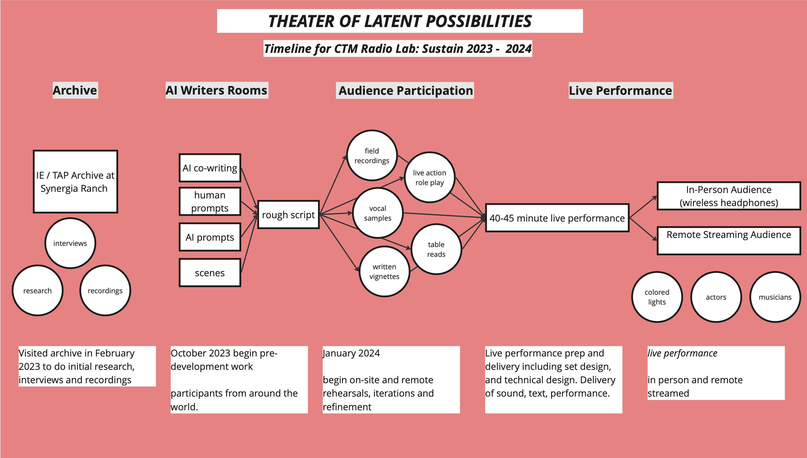

# Theater of Latent Possibilities   Proposal for CTM Radio Lab: Sustain

[Description](#description) - [Timeline](#timeline) - [Technical Requirements](#technical-requirements)

# Description

Our Radio Play is rooted in the work and archives of the Theater of All Possibilities (TAP) and the Institute of Ecotechnics (IE)—an artistic practice network and touring theater founded in 1967 in San Francisco by Kathelin Gray and others. Most famous for creating Biosphere 2 in Oracle, Arizona, the group worked with international collaborators from the sciences, technology, history, and ecology to rehearse and deploy sustainable ecological futures. Their archives are based at Synergia Ranch near Santa Fe, New Mexico, where we conducted initial onsite research in February 2023. Other projects of note include the Research Vessel Heraclitus, which has sailed around the world (12 trips around the world and still going), and the Hotel Vajra in Kathmandu. 

For CTM’s Radio Lab: Sustain call, we will use the archives and generative tools to co-create the script and sounds for a radio play drama. The archive becomes a site for generating and sustaining endless possibilities. This piece extrapolates from existing projects—the Research Vessel Heraklitus, Synergia, Biosphere2, and the Institute of Ecotechnics—to project and uncover a fictional fifth project, Project X. This secret, speculative project recovers latent possibilities from the work of TAP and IE, developing a counterfactual to produce an alternate present. For Sustain, we will work to draw out biological and ecotechnical threads from this process, extending into plant and animal intelligences and systems for live performance. Liveness is a key element in our re-performance of the archive, allowing spontaneous and unique interactions to emerge. This piece builds on the techniques of performative AI we have developed for our previous projects, such as AI Radio Play, working towards real-time generative storytelling. 

Our performance will take the form of a live-staged radio play and immersive theater performance, co-written and co-performed with AI tools. As IE’s works were test cases and demonstration projects reckoning with our global human/non-human interdependence in times of ecosystemic change—here we are interested in how performance can push new boundaries for sustainability (SUSTAIN) for all species, how radio performance and sound artwork as emergent narrative systems, and how emerging technologies (TEKHNÉ) provide new platforms for the future of storytelling.

The radio performance will integrate contemporary language generation models into the writing and production of the radio broadcast, building on traditions from the golden age of radio (think Orson Welles' Mercury Theater on the Air), but engaging with the emergent possibilities of generative AI technology. We will devise the script and sounds for this event before January 2024. The performance will be polyvocal, mixing language from research science, speculative fiction, and theater, exercising the LLM (large language model) capabilities to engage with the language, history, and research conditions of IE.

Drawing on the mission of the tekhné project, our radio performance explores the immanent changes wrought by generative AI—demonstrating possible models for creative symbiosis in human/non-human co-authorship and exploring new ideas of performance and collective imagination in the age of intelligent machines. Our theater's human and non-human participants collectively establish, refine, and perform an emergent text, illuminating ecological futures and technological possibilities. Through participatory co-authorship, we invent new worlds and create symbiotic imaginaries, imagining ecological futures that resonate with the theme SUSTAIN. 

## Radio as Speculative Design

The Theater of All Possibilities used theater and performance to prototype design fictions and art-science experiments. Their speculative designs have present-day impact, from building the research vessel Heraclitus to building hotels in Nepal and creating Biosphere 2. For CTM’s Radio Lab: Sustain, we embrace and extend the ambition of this group, testing the power of radio drama to imagine possible futures, creating a new radio drama from the latent possibilities of this group.

Biosphere 2 is an American earth system science research facility in Oracle, Arizona. Its mission is to serve as a center for research, outreach, teaching, and lifelong learning about Earth, its living systems, and its place in the universe. Our piece reimagines the Theater of All Possibilities archive and projects, including the Biosphere 2. Archival extrapolations have the ability to reimagine the future and conjure up counterfactuals and alternative presents that can shape reality. Archives are often unwieldy and locked away, frequently surfacing singular, dominant narratives. By engaging the archive as data, and using generative technologies to extend it, we are able to bring latent possibilities, dreams, hopes, and entanglements—other ways of being—to the surface.

# Timeline

This radio play is in mid-development as a collaboration between Ash Eliza Smith, Robert Twomey, and Kathelin Gray and will invite special guests to contribute in Berlin. It builds on the deep experience and expertise of the three artists. Kathelin brings 40+ years of experience writing and producing experimental theater and larger eco technic projects globally, including the Research Vessel Heraclitus and Biosphere 2. Ash Eliza Smith and Robert Twomey bridge technical, artistic, and performance worlds, and most recently, have developed a live AI Radio Play using similar techniques to what will be employed here. We aim to use this as space to create the first iteration from which we can gain funding and support with an eventual idea of having a fully supported broadcast using wind or solar energy, attempting to put much of IE’s theories into practice.

**Production phase** (remote): October 2023 – January 2024
- Writing Workshop to develop script 
- Sonic Workshops to develop sonic elements
- Technical prototyping
- Design Workshop 
- Remote Table Reads and tests (with local Berlin talent)

**Final production phase** (residency in Berlin): January 2024
- Work with local talent (voice and sound)
- refining script
- proving software systems for realtime performance
- finalize musical score

**Presentation**
- CTM 2024 Festival: 26 January – 4 February 2024
- Apply for more funding/support
- Deutschlandfunk Kultur – Klangkunst radio broadcast: Spring 2024
- Presentation via ORF: Autumn 2024

# Technical Requirements

Remote Development Phase
- 3 x laptops*
- discord server with AI writing tools*

Residency and Performance
- 8 channel mixer board
- 4 x Wireless Microphones (Shure) microphones
- stage lighting and gels / LED
- 3 x laptops*
- 4 x ipads with AI performance software*
- 50 wireless headsets and transmitters*

*Artist provided equipment

 
 

_This project is made possible through generous support from the Johnny Carson Center for Emerging Media Arts_
